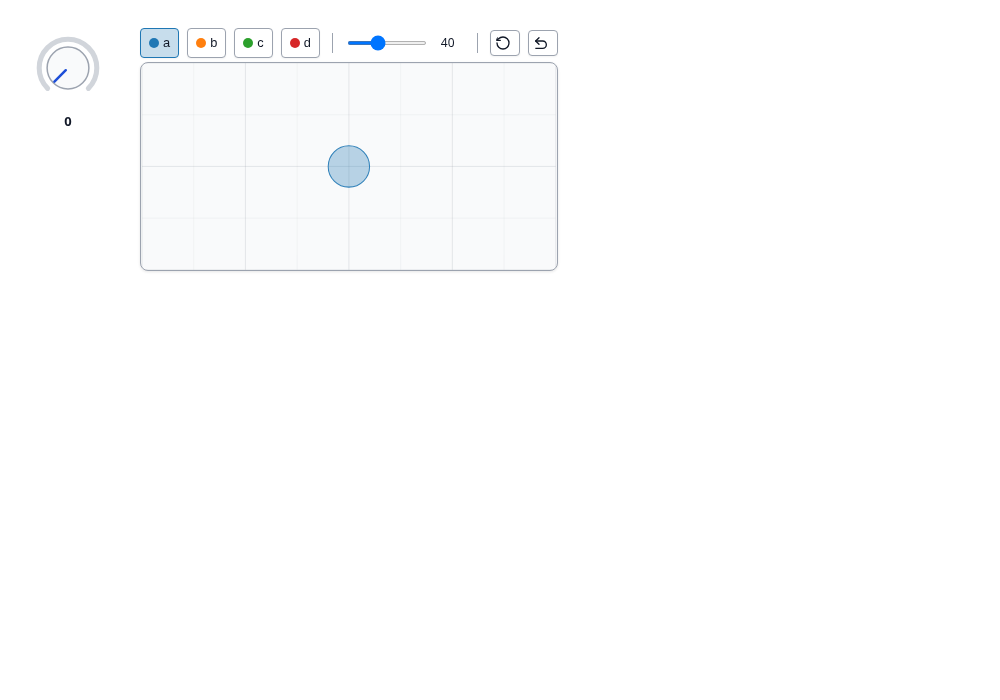

# Published anywidgets (PyPI)

Anywidgets published on PyPI load **without Python**. A wheel is a zip
archive: Anywidget.jl downloads it, checks its SHA-256, extracts it, and reads
the widget class from its Python source as text. Python is never run.

```julia
using Anywidget

knob = pypi_anywidget("wigglystuff"; class = "Knob", value = 30.0)
scatter = pypi_anywidget("drawdata"; class = "ScatterWidget")
html_page("pypi.html", knob, scatter)
```



## What is read

For the chosen class (deriving from `anywidget.AnyWidget`, directly or through
other classes of the package):

| In the class | Read as |
|---|---|
| `_esm = """export default …"""` (plain, raw, triple-quoted) | inline module |
| `_esm = pathlib.Path(__file__).parent / "static" / "widget.js"` | file of the wheel |
| `_esm = DIR / "widget.js"` with `DIR = Path(__file__).parent / "static"` | file of the wheel |
| `_css = …` | same forms |
| `count = traitlets.Int(3).tag(sync=True)` | default trait `count = 3` |
| attributes not redefined by a subclass | inherited from its base class |

Trait defaults are read when their first argument is a literal (numbers,
strings, `True`/`False`/`None`, lists, tuples, dicts) or absent (`Int()` is 0).
Other traits are left to you: pass them as keywords to `pypi_anywidget`.

## When static reading is not enough

Some packages build their front end at runtime (for example
`_esm = get_esm()` concatenating several files). Anywidget.jl then says so and
asks for the module file of the wheel:

```julia
pypi_module("somepackage"; esm = "somepackage/static/bundle.js")
```

## Choosing a class and a version

```julia
pypi_module("drawdata")                               # error: BarWidget, ScatterWidget
pypi_module("drawdata"; class = "ScatterWidget")
pypi_module("drawdata"; class = "ScatterWidget", version = "0.5.2")
```

Without `class`, the only class of the project that has a front end is used.

## Cache and index

Extracted wheels are kept in `<depot>/anywidget/pypi` (`ANYWIDGET_CACHE` or the
`cache` keyword) and reused. The index is `https://pypi.org/pypi`
(`ANYWIDGET_PYPI_INDEX` or the `index` keyword, for a mirror).

Tested against drawdata, ipymolstar, lonboard, mosaic-widget, quak and
wigglystuff.
